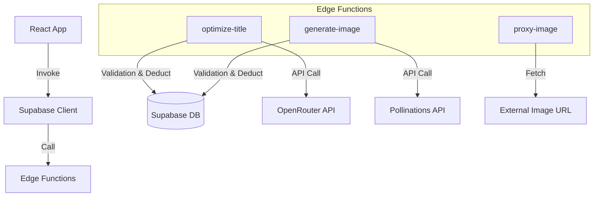

# AI Integration Guide

## Overview

CoverView integrates AI capabilities using **Supabase Edge Functions**. This architecture ensures security, rate limiting, and centralized credit management.

## Features

### 1. AI Title Optimization
- **Function**: `optimize-title`
- **Provider**: OpenRouter (using generic models like GPT/Claude via router)
- **Cost**: 1 Credit per use
- **Input**: Raw title
- **Output**: 3 optimized suggestions (Professional, Catchy, Simple)

### 2. AI Image Generation
- **Function**: `generate-image`
- **Provider**: Pollinations.ai
- **Cost**: 10 Credits per use
- **Input**: Title (used as prompt)
- **Output**: Generated Image URL

### 3. Image Proxy (CORS)
- **Function**: `proxy-image`
- **Purpose**: Proxies external images (like from `t.alcy.cc`) to add CORS headers, enabling them to be drawn on the canvas for download.

## Architecture

## Implementation Details

### Frontend (`src/services/aiService.js`)
The `aiService` acts as a wrapper around `supabase.functions.invoke`. It handles the response format and error propagation.

### Backend (Supabase Edge Functions)
Located in `supabase/functions/`. Each function:
1.  **Authenticates** the user via the implementation-injected Authorization header.
2.  **Deducts Credits** using the `deduct_credits` RPC (except `proxy-image`).
3.  **Calls External AI API**.
4.  **Returns** result + remaining credits + cost.

## Security
- API Keys (OpenRouter, etc.) are stored as **Supabase Secrets**, never exposed to the client.
- Database updates are performed via a trusted Stored Procedure (`deduct_credits`) with `FOR UPDATE` locking to prevent race conditions.